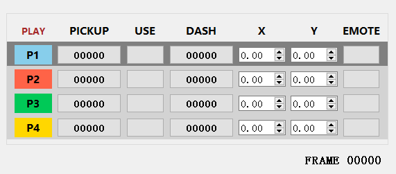
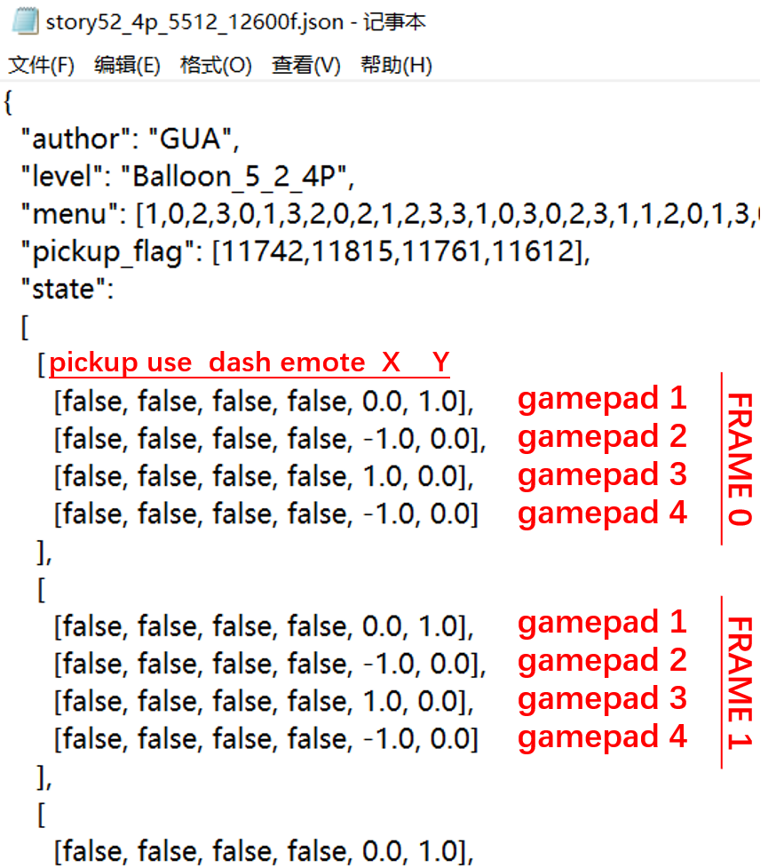

# Overcooked! 2 - TAS Tool

## Tools required

- Python 3.10
- [BepInEx 5 (x86)](https://github.com/BepInEx/BepInEx/releases)
- [ffmpeg executable](https://www.gyan.dev/ffmpeg/builds/)


## Features

This tool contains two parts:

- The `BepInEx` plugin (`plugin/`), which is loaded into the game.
- An external `Python`-based virtual gamepad controller and recorder (`controller/`).

### In-game plugin

#### Installation

Copy `plugin/bin/Release/OC2TAS.dll` and `ffmpeg.exe` to the game's `BepInEx/plugins/` folder.

#### Features

- Press `F9` to pause/resume the game, while paused, press `F11` to step to the next frame.
- Press `F10` to replay the `replay.json` script in the same directory (`BepInEx/plugins/`). The game will be paused at the end of the replay. You can press `F10` to abort the replay. The time required for replay depends on the performance of your computer and does not match the real time.
- Press `F1` to record video with `replay.json` script in the same directory, the output directory is `D:/TAS output/`. You can press `F1` to abort the recording. The recording takes a long time due to the audio and video encoding.

#### Compiling

You may modify the code and recompile it. The following dependencies need to be copied into the `plugin/lib/` directory: 

- In the game's `Overcooked2_Data/Managed/` directory `Assembly-CSharp.dll`, `UnityEngine.dll`, `UnityEngine.AnimationModule.dll`, `UnityEngine.AudioModule.dll`, `UnityEngine.CoreModule.dll`, `UnityEngine.ImageConversionModule.dll`, `UnityEngine.IMGUIModule.dll`, `UnityEngine.ParticleSystemModule.dll`, `UnityEngine.PhysicsModule.dll`, `UnityEngine.TextRenderingModule.dll`.

- In `BepInEx/core/` directory `0Harmony20.dll`, `BepInEx.dll`, `BepInEx.Harmony.dll`.

### Virtual gamepad controller and recorder

<div align="center">
    
</div>

#### Install the Python environment and run

```
pip install -r ./controller/requirements.txt
```

During the process the virtual gamepad driver will be installed

```
cd ./controller
python ./controller.py
```

#### Features

- After running, four virtual gamepads are created, the number keys `1` `2` `3` `4` can be used to switch between the gamepads you want to control.

- `w` `a` `s` `d` controls the direction, other keys can be set in `UIFunc.keymap` in `controller.py` (mapped to the `A` `B` `X` `Y` buttons of the virtual gamepad). Additionally, the Enter key is mapped to the `A` button, in order to avoid adding keyboard players from pressing space when adding players in the main menu.

- Besides the eight angles derived from up, down, left, and right, other angles can be set by using the mouse wheel to modify the `X`, `Y` values while recording. ⚠️**Do not click the input box. Losing focus on the game window will cause the gamepad input to fail.**

- Press `F3` to switch between play mode/record mode. In record mode, press a key once to press and press again to release the corresponding gamepad button, similar to the direction keys.

- In record mode, press `F11` to record the current gamepad state and step to the next frame. The default gamepad state of the next frame is the same as the previous frame.

- In record mode, press `F5` to save the script recorded up to the last frame to the `records/` directory. The script will also be saved automatically when switching back to play mode.

- In play mode, press `F10` to read the `replay.json` script in the `BepInEx/plugins/` directory of the game as the history and continue recording from the next frame of the script. ⚠️**You need to change the `UIFunc.replay_file_path` in `controller.py` to the correct path.**

- There are two important cooldowns in the game: 

  pickup - 25 frames (0.5 seconds) 

  dash - 20 frames (0.4 seconds)

  For convenience, there are counters on the corresponding buttons in the UI, where the dash counter is updated every time the dash key is pressed, and the pickup counter is updated by manually pressing the `left alt` key.

- The number key `0` can be used to pause/resume the controller's response to keyboard input.

### Script format

<div align="center">
    
</div>


Scripts are saved in json format.

> - `author` is the script author, which can be set in `UIFunc.author` in `controller.py`.
> - `level` is the script's level name, which will be filled in automatically when you first record a level.
> - `menu` is the fixed menu used by the script.
> - `pickup_flag` is the value of the four pickup counters when saving. The counters are loaded when replaying (pressing `F10`).
> - `state` is the main content of the script, it records the value of each button of each gamepad of each frame, `false` means the button is released, `true` means the button is pressed, and the direction value is in the range [-1, 1]. When replaying, the dash counter will be loaded with the correct value based on the `state` content.


## Recording workflow


### Start recording

1. `python ./controller.py` to run the controller, then start the game and add several virtual gamepad players.

2. Enter the level and press `F9` to pause at the level preparation (i.e., the "Ready? Go!" phase), then press `F10` to generate an empty script at `BepInEx/plugins/replay.json`.

3. Edit the script and fill in the `menu` with the fixed menu.

   > #### Menu numbering order
   > - If you have UnityExplorer installed, you can see the menu numbering order in the `FlowManager` game object, `Server*FlowController` component, `LevelConfig.m_rounds[*].m_recipes.m_recipes` field.
   > - You can also fill it in arbitrarily, replay the script, and watch the menus appear to determine the menu numbering order.
   > - ⚠️**Note the [legality](https://www.bilibili.com/read/cv11638996) of a menu.**

4. Subsequent recording starts with replaying this empty script.

### Replay and resume recording


1. Copy the script to be replayed into the game's `BepInEx/plugins/` directory and rename it to `replay.json`.


2. Edit the script, e.g. delete some frames at the end that need to be re-recorded or change the value of some buttons (⚠️**make sure the script is in the correct format, no extra commas**).


3. Enter the level and press `F9` to pause at the level preparation, then press `F10` to replay (the controller will automatically switch to record mode and read the script as history).


4. After replay, you can continue to record, and press `F11` to step to the next frame after completing the key input of each frame.


   > #### Partial re-recording
   >
   > Sometimes when you only want to re-record the last frames of a certain player, you can use partial re-recording instead of deleting the last frames of all players.
   > 1. Find the starting frame to be re-recorded in the script, and change the value of the first key of the player to be re-recorded to `null` (the automatically generated empty script contains one frame with 4 `null`s).
   > 2. Replay the script.
   > 3. ⚠️**After the replay is over, press `F11` one additional time to load the gamepad states of the non-re-recording players of the first frame after the replay (the game will not step by one frame on this press of `F11`)**.
   > 4. Continue recording, and at each subsequent frame the non-re-recording players' gamepad states will be automatically loaded from the script.
   > 5. Once out of the range of the script, return to normal recording.


5. Press `F3` and `F9` to end recording and return to normal play mode, and the script is automatically saved in the `records/` directory.


### Final Video Recording


Enter the level and press `F9` to pause at the level preparation, then press `F1` to record the video with the `replay.json` script. The output directory is `D:/TAS output/`.

### Position correction

In most cases, the result obtained from replay is deterministic. However, since the Unity engine's physics calculations are not completely deterministic, in some cases there can be small deviations in player and item coordinates that cumulatively can lead to incorrect results, such as going up and down stairs, or items not attaching to a countertop. Position correction can be used to ensure replay determinism in these cases. Add a key-value pair to the script like

```json
  "position_correction": 
  [
    ["Player 4", 2066, 9.4302, 0.0000, 10.6001],
    ["Player 3", 2170, 2.2029, 0.0000, 10.6480],
    ...
  ],
```

where each position correction instruction is composed of `[object name, frame position, x, y, z]`, meaning that the coordinate of the object is set to `(x, y, z)` at that frame. The plugin supports pressing `F8` to show/hide the player's coordinates.

> - ⚠️**This feature is against the principle of TAS that you can't modify the logic of the game, so please use it with caution. If you have to use it, please make sure that every position correction instruction comes from the result of a certain replay.**
> - ⚠️**Note that position correction instructions only modify position coordinates, and that other kinematic properties such as speed are also affected by indeterminacy when the object is accelerating, decelerating, or changing direction.**
> - When replaying, if the original coordinate is already the same as the coordinate in a position correction instruction, no changes will be made. The output log (`BepInEx/LogOutput.log`) contains the information of the execution of the position correction instructions. **It should be ensured that every instruction is at least once not executed.**
> - For game objects other than players, you need to use tools such as `UnityExplorer` to view the object name and coordinate.


## Tips

- **The fixed frame rate for recording is 50 fps.**

- **To make the controller window sit on top of the full-screen game, you need to add a startup option `-popupwindow` to the game.**

- Some keys have feedback immediately after being pressed, such as pickup and place, chop and wash, throw aim, and throw. Dash key needs to step one frame to take effect. If you find that the dash key is pressed wrongly, just change it back to release before stepping one frame.

- Some operations cannot be done in the same frame, including but not limited to:

  - Player A places an item, then Player B picks it up
  - Player A switches sauces, then Player B adds the sauce
  - Release the use button to throw an item, then pick up another item

  The following actions can be done in the same frame:

  - Place an item, then chop or wash it
  - Pick up an item, then throw aim
  - Pick up or place an item, then dash or change direction

  It is possible to immediately interact with an item that has undergone a state change in the previous frame, e.g. picking up an ingredient that has just been chopped, plating the food in a pot that has just been cooked, or placing an ingredient that has just been caught from a throw.

- Avoid operations that contain ambiguities, including but not limited to:

  - 180-degree turns, such as inputting direction (-1.0, -1.0) for a Player facing (1.0, 1.0) (up against down and left against right do not have this ambiguity)
  - Placing or picking up at the division of two counters, e.g. on the center vertical line of two side-by-side tables, or at the corner of right-angled tables and facing 45 degrees

- For final video recording, please continue recording the script after the end of the level until the desired video end time.


## Known bugs

- Occasionally the game will read incorrect input from the virtual gamepads while recording, causing items to be thrown or placed unexpectedly.
- Occasionally the driver fails to correctly remove the virtual gamepads when closing `controller.py`, resulting in an error on the next run. A restart of the computer is required (the system may blue screen and fix the driver).
- Turning on the `BepInEx` console may cause the game to fail with gamepads. Set the value `Enabled = false` in `[Logging.Console]` in the `BepInEx/config/BepInEx.cfg` configuration file.


## About TAS

@hpmv implements an alternative [high-level action-based TAS framework](https://github.com/hpmv/overcooked-supercharged), and you can read [his documentations](https://hpmv.dev/docs/tas/) for a detailed discussion of Overcooked! 2 TAS.

This framework is based on raw button input, which is the simplest and most low-level implementation. Unfortunately, due to Unity games having dynamic logical frame rates, we have to make some changes to the original game logic, here are the main ones:

- Fixed frame rate 50, i.e., `Time.captureFramerate = 50`.
- Assuming the game logic frame rate is infinite. In the original game logic, there is a delay of 1 to 2 logic frames for events that should take effect immediately, even if the game is played locally. We don't want to waste these delays in a fixed frame rate of 50 frames per second. Since logic frame rates are generally > 200 >> 50, we assume that the game's logic frame rate is infinite and erase such delays.
- Using position correction instructions as a last resort.

**Any TAS scripts made with this tool are welcome to be committed to this GitHub repository.**


## Development aid tools

- [dnSpy](https://github.com/dnSpy/dnSpy)

  > Open `Overcooked2_Data/Managed/Assembly-CSharp.dll` in the game directory to view and modify the game code.

- [UnityExplorer](https://github.com/sinai-dev/UnityExplorer)

  > View game objects and components in the game.